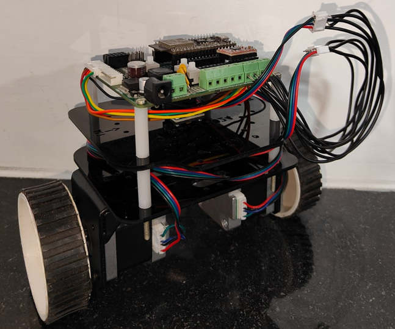
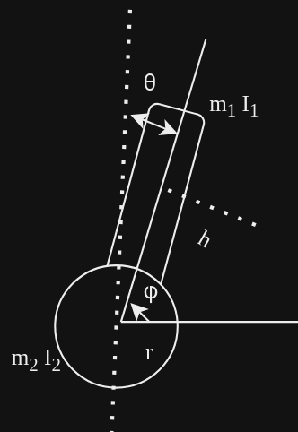
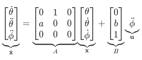
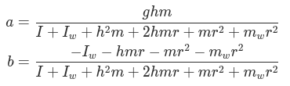
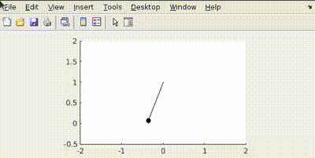
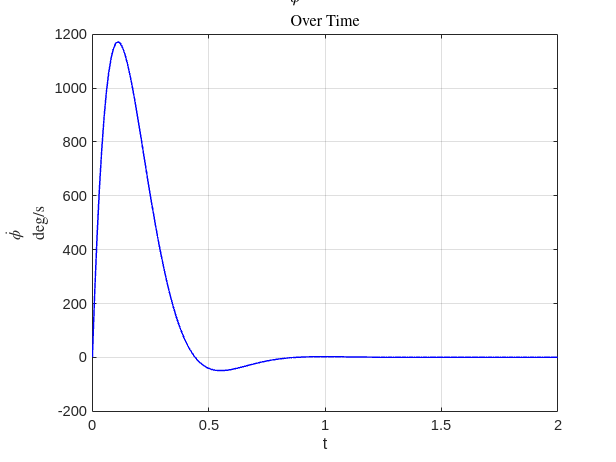
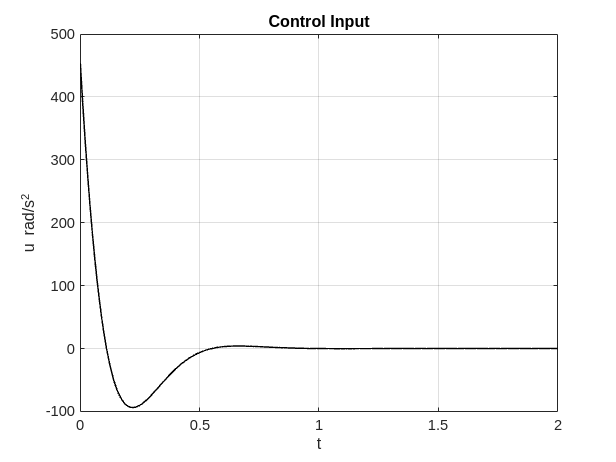

## LQR Balancer
This project is dedicated to developing a self-balancing robot using advanced control techniques. Unlike conventional PID controllers, this project uses Linear Quadratic Regulator (LQR) to maintain stability, combining an ESP32, NEMA17 stepper motors, and A4988 motor drivers for a sophisticated control mechanism offering stability and responsiveness. 

  

---
### New to LQR?
Linear Quadratic Regulators (LQR) are optimal controllers for managing multiple control objectives in linear dynamic systems. By describing the robot with linear equations, LQR provides an optimal control input to minimize a cost function balancing state deviations and control effort, computed using the continuous-time algebraic Riccati equation (CARE).

### Mathematical Model
Our bot consists of a cart with two wheels balancing an inverted pendulum. Key parameters include:

  

 

  

  

- LQR Controller: Computes optimal control actions to minimize the cost function, balancing stability and control effort.
- Control Signal Output: Converts control outputs into PWM signals or step commands for the motor drivers.
- Motor Actuation: NEMA17 stepper motors adjust the bot's angle and position based on control inputs.
- Feedback Loop: Continuous feedback from the MPU6050 sensor forms a closed-loop control system.

### MATLAB Simulations
We simulated the dynamics of a pendulum and inverted pendulum on a cart using MATLAB. This involved solving the equations of motion, designing an LQR controller, and visualizing results to refine control strategies.

  

  

#### Current model parameters- 

  

  

  

### Hardware
Components Used: SRA board, ESP32, MPU6050, NEMA17 stepper motors, A4988 motor driver, Wall E assembly, stepper holders.

#### Future Plans
- More hardware debugging to optimize K
- Real-time plotting of state variables.
- Synchronize UDP rate of angle readings with stepper frequency updates.
- Implement step response for angle stabilization.
- Use Kalman filter for precise state estimation.
